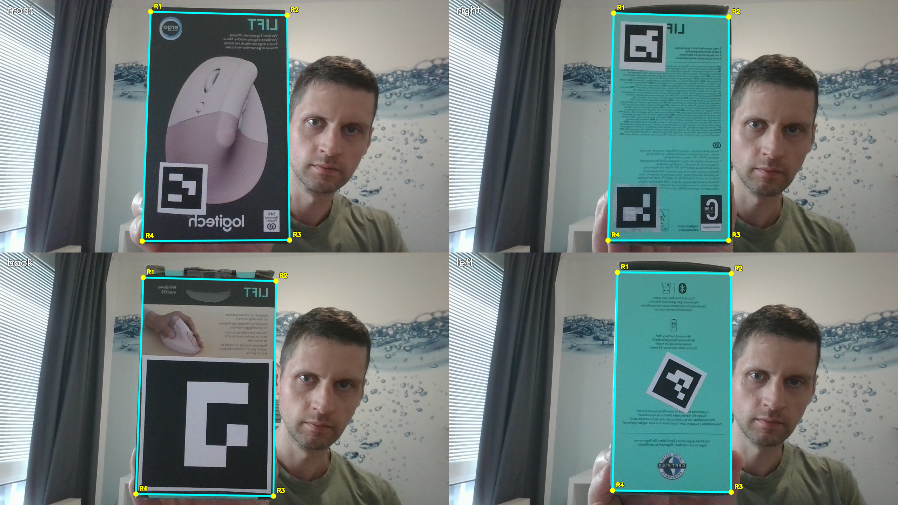

# State Based Pose Tracking

This project is a state-based box pose tracking system that combines multiple computer vision methods to improve 
robustness and tracking stability.


The system first scans the camera feed and checks if ArUcos are present in the image. And then it switches between
those 2 states.


<video controls width="800">
  <source src="images/box_track.mp4" type="video/mp4">
</video>

```text
Camera
   ↓
ArUco detection
   ├── Yes → ORB/Akaze and Optical Flow refinement → solvePnP
   └── No  → YOLO → ORB/Akaze and Optical Flow → solvePnP  
   ↓
Pose outlier detector 
   ↓
Kalman filtering
```

### ArUco Tracking Mode

When ArUco markers are visible, they are used as the primary source for solvePnP pose estimation.
Small or distant ArUcos can introduce noticeable jitter, so the system additionally uses **ORB/Akaze** 
feature matching and **Optical Flow** tracking to generate additional feature points and improve pose stability.

### Fallback Tracking Mode (No ArUcos Visible)

If no ArUcos are visible due to occlusion or markerless box sides, the system switches to a fallback 
mode using only **ORB/Akaze** and **Optical Flow** tracking.
To improve feature matching stability in cluttered scenes, **YOLO** is used to isolate the box 
region from the background before feature extraction.  
This mode is computationally heavier and results in lower frame rates.


### Pose Stabilization

When the box becomes nearly planar to the camera, solvePnP can become unstable and flip between two rotations.

To reduce this effect, the system applies additional rotational stabilization before passing 
the result through a **Kalman filter** to smooth short-term pose jitter.


# How to use it on any box

### Capture the sides

The mandatory part of the setup is just capturing the sides, and annotating those captures by drawing a rectangle
on the sides. No ArUcos are needed to be specified. The tool will automatically check in the images if there are ArUcos present and take their
measurements automatically.
  
This section explains how to create these 4 images with their annotations:  
  

First capture the sides of the box. Run the following command:

``` bash
python setup/annotate_image.py front
```
Hold the **front** side into the camera, as frontal as possible, and click SPACE. This creates or overwrites
*front.png* inside the captures directory. Click q to close, and then run:

``` bash
python setup/capture_image.py front
```
This opens the *front.jpg* image and let's you draw the rectangle by just clicking on the corners. When done, hit q to
close. This generates the *front.json* file that contains the info about the rectangle.

Repeat this process for each side by substituting **front** with the corresponding other side name 
(**left**, **right**, **back**, **bottom**, **top**). You don't need to do all of them.

Do not confuse left and right. Side names are defined in the box's local coordinate system, not relative to the screen or camera view.
(If you hold the box with the front face pointing forward, the side physically on your left corresponds to the left plane)

### Yolo
This is not mandatory, but a model that detects the box can make it more stable when no ArUco markers are visible.
Just generate a model (preferable using *Ultralytics*), that tracks the box. Class name doesn't matter in this case.
Specify that model in the app config's **model_path**, supported model types are **Ultralytics**, **ONNX** and **TensorRT**.


### Camera Calibration

Camera Calibration is not mandatory either, but it can help the results. To start, put the *setup/calibrate_pattern.png*
image on an iPad or print it on a flat, rigid surface (thick paper, cardboard, or plastic, don't use a 
paper that changes form), and run:


``` bash
python setup/calibrate_camera.py
```
Hold that pattern into the camera and hit SPACE. Repeat that 12 times by showing it from different angles.
When you hit q, he calculates the calibration from your images, and saves it into a json file. The next time you run 
*box_track.py*, it will automatically pick that calibration file.


# Challenges
Feature mapping with ORB/Akaze is extremely messy, and SolvePnP is sensitive. Alone a tiny jittering from ArUcos 
can produce an agressive jumping on the whole box.  
And adding more and more checks and stabalizing systems mades the evaluation speed suffer quickly. The biggest
bottleneck is checking/verifying homography on the ORB/Akaze features.


# Known Limitations
- If the box moves away from camera and becomes smaller, jittering becomes stronger quickly.
- Camera needs to be either high resolution, or the box needs to be close to camera for this to work stable.


